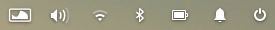
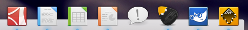

# elementary+ Icon Theme

This theme is a community maintained addition to elementary OS's default icon theme. It contains icons for several third party applications that resemble elementary OS's style.

## Intention
[DanRabbit](http://danrabbit.deviantart.com/) indicated [on deviantART](http://danrabbit.deviantart.com/art/elementary-Icons-65437279), that the original theme is most likely to be limited to applications installed on elementary OS by default.
I understand that decision. They want to keep the theme clean and compact. 

This is why I hope for this repository to become a central place to collect additions that integrate third party applications into the elementary desktop.

## CREDITS
See [CREDIT](CREDIT.csv) for a list of sources and authors of the work contained in this collection as well as the corresponding licences.

## How to Install

Just download the directory or clone the repository and run `./install.sh` from the parent directory of this repository
Then select the theme in [elementary tweaks](https://code.launchpad.net/~versable/elementary-community/elementary-tweaks).

Please also make sure, that the original elementary icon theme is installed, because elementary+ only provides additions and inherits the base theme.

### Dropbox Indicator
If you want to make the dropbox indicator visible, you can simply execute `./scripts/show_dropbox_indicator.sh` from the parent directory of this theme.

## Contribute

I am waiting for your pull requests and would love to see this theme become as complete as possible.

Please make sure that your icons fit the overall look and feel of elementary OS.
It is advised to have a look at elementary OS's [human interface guidelines for icons](http://elementaryos.org/docs/human-interface-guidelines/icons) before you start designing.

If you are planning to implement status icons you may want to check [faba](http://mokaproject.com/faba-icon-theme/) or [Numix](https://github.com/numixproject) beforehand. They make a good base for monochromatic status icons. The owncloud icons e.g. were simply converted to a white foreground color which looks good, imho.
